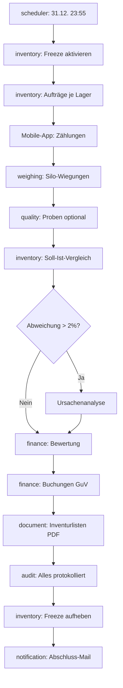
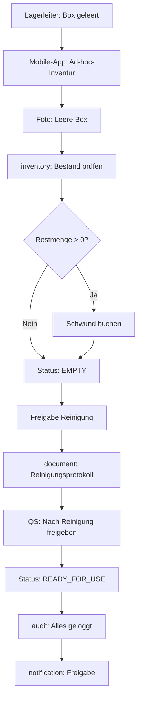

# 📊 Inventur-Workflows – VALERO NeuroERP

**Zweck:** Revisionssichere Bestandsaufnahmen (jährlich + unterjährig)

**Compliance:** HGB §240, §241, GoBD, ISO 9001

---

## 🗓️ Inventur-Typen

### 1. Jährliche Inventur (Stichtag: 31.12.)

**Trigger:** scheduler-domain (31.12. 23:55 Uhr)

**Umfang:** Alle Lager, Silos, Außenlager, Konsignationslager

**Besonderheit:** Buchungsrelevant (GuV, Bilanz, Jahresabschluss)

---

### 2. Unterjährige Inventur (Ad-hoc)

**Trigger:** Manueller Start oder automatisch bei:
- Leerung Düngerbox (z.B. nach Komplettreinigung)
- Leerung Getreidelagerhalle (z.B. nach Schädlingsbefall-Sanierung)
- Silo-Reinigung (vor Sortenwechsel)
- Außerplanmäßige Prüfung (nach Verdacht auf Schwund)

**Umfang:** Einzelne Lagerorte/Silos

**Besonderheit:** Nicht buchungsrelevant, nur Bestandskorrektur

---

## 📋 Workflow 1: Jährliche Inventur (31.12.)

### Phase 1: Vorbereitung (T-7 Tage)

**Verantwortlich:** Lagerleitung + Controlling

**Schritte:**

1. ✅ **Inventurauftrag erstellen**
   ```bash
   POST /inventory/api/v1/audits
   {
     "tenantId": "tenant-abc",
     "type": "ANNUAL",
     "referenceDate": "2025-12-31T23:59:59Z",
     "locations": ["all"],
     "triggeredBy": "scheduler"
   }
   ```

2. ✅ **Zählteams einteilen**
   - HR-Domain: Verfügbarkeit prüfen
   - Mobile-App: Zählblätter vorbereiten

3. ✅ **Benachrichtigungen**
   - Email an Lagerleitung (T-7d)
   - SMS an Zählteams (T-1d)
   - Domains: notifications-domain

4. ✅ **System-Freeze vorbereiten**
   - Wareneingang ab 31.12. 18:00 Uhr gesperrt
   - Warenausgang ab 31.12. 20:00 Uhr gesperrt

**Checkpoint:** ✅ Teams eingeteilt, System bereit

---

### Phase 2: Durchführung (31.12. 20:00 - 01.01. 06:00)

**Verantwortlich:** Zählteams + Lagerleitung

**Schritte:**

1. ✅ **System-Freeze aktivieren**
   ```bash
   POST /inventory/api/v1/freeze
   {
     "tenantId": "tenant-abc",
     "reason": "ANNUAL_INVENTORY",
     "until": "2026-01-01T06:00:00Z"
   }
   ```

2. ✅ **Zählungen durchführen**
   - **Methode A:** Mobile-App (online)
   - **Methode B:** Papier-Zählblätter (offline → später erfassen)
   - **Methode C:** Wiegungen (für Schüttgüter)

   **Mobile-App-Flow:**
   ```
   1. Lagerhalle scannen (QR-Code)
   2. Artikel scannen (EAN/Barcode)
   3. Menge erfassen (Stückzahl oder kg)
   4. Foto optional (bei Unklarheiten)
   5. Submit → inventory-domain
   ```

3. ✅ **Qualitätsproben** (optional)
   - 5% der Chargen → quality-domain
   - Feuchtigkeit, Verunreinigungen, Schädlingsbefall

4. ✅ **Wiegungen** (für Silos/Schüttgüter)
   - weighing-domain: Silo-Wiegung via Füllstandssensoren
   - Alternativ: Entnahme-Probe → Hochrechnung

**Checkpoint:** ✅ Alle Zählungen erfasst, Daten in System

---

### Phase 3: Auswertung (01.01. 06:00 - 08:00)

**Verantwortlich:** Controlling + Lagerleitung

**Schritte:**

1. ✅ **Soll-Ist-Vergleich**
   ```bash
   GET /inventory/api/v1/audits/:id/comparison
   
   Response:
   {
     "location": "Halle-A",
     "expectedQty": 250.5,  // System (Soll)
     "countedQty": 248.2,   // Gezählt (Ist)
     "variance": -2.3,      // Abweichung
     "variancePercent": -0.92
   }
   ```

2. ✅ **Abweichungsanalyse**
   - Schwund < 0.5%: ✅ Normal
   - Schwund 0.5-2%: ⚠️ Prüfen
   - Schwund > 2%: 🔴 Incident, Ursachenanalyse

3. ✅ **Bewertung** (finance-domain)
   ```bash
   POST /finance/api/v1/valuation
   {
     "auditId": "audit-2025",
     "method": "FIFO",
     "asOfDate": "2025-12-31"
   }
   
   Response:
   {
     "totalValueNet": 1250000,  // GuV-wirksam
     "variance": -15000         // Schwund-Buchung
   }
   ```

4. ✅ **Buchungen erstellen**
   - Bestandskorrektur (Soll → Ist)
   - Schwund-Buchung (GuV)
   - finance-domain

**Checkpoint:** ✅ Abweichungen geklärt, Bewertung abgeschlossen

---

### Phase 4: Dokumentation (01.01. 08:00 - 10:00)

**Verantwortlich:** Controlling + Audit Officer

**Schritte:**

1. ✅ **Inventurlisten generieren** (document-domain)
   ```bash
   POST /document/api/v1/documents
   {
     "docType": "inventory_list",
     "templateKey": "inventory_annual_2025",
     "payload": {
       "auditId": "audit-2025",
       "date": "2025-12-31",
       "locations": [...],
       "summary": { "total": 250, "variance": -2.3 }
     }
   }
   ```

2. ✅ **Abweichungsberichte** (PDF)
   - Pro Lagerhalle
   - Gesamt-Übersicht
   - Unterschrift Lagerleitung

3. ✅ **Audit-Trail**
   - Alle Zählungen geloggt
   - Bewertung dokumentiert
   - Buchungen revisionssicher
   - audit-domain

4. ✅ **System-Freeze aufheben**
   ```bash
   POST /inventory/api/v1/unfreeze
   ```

**Checkpoint:** ✅ Inventur abgeschlossen, Dokumente für Prüfer bereit

---

## 🏭 Workflow 2: Unterjährige Inventur (Ad-hoc)

### Trigger-Szenarien

#### Szenario A: Düngerbox geleert & gereinigt

**Anlass:** Komplette Entleerung vor Reinigung/Wartung

**Erwartung:** Bestand = 0 t

**Ablauf:**

1. ✅ **Inventur-Auftrag erstellen** (manuell)
   ```bash
   POST /inventory/api/v1/audits
   {
     "type": "AD_HOC",
     "reason": "DUNGERBOX_CLEANING",
     "location": "Düngerbox-3",
     "expectedQty": 0,
     "triggeredBy": "user-lagerleiter-123"
   }
   ```

2. ✅ **Visuelle Prüfung + Foto**
   - Mobile-App: Foto von leerer Box
   - Optional: Wiegung (sollte 0 kg sein)

3. ✅ **Bestandskorrektur** (falls Restmenge > 0)
   ```bash
   POST /inventory/api/v1/movements
   {
     "type": "CORRECTION",
     "location": "Düngerbox-3",
     "sku": "NPK-15-15-15",
     "qty": -0.5,  // Restmenge als Schwund buchen
     "reason": "Cleaning residue",
     "auditId": "audit-adhoc-2025-045"
   }
   ```

4. ✅ **Freigabe für Reinigung**
   - Status: `EMPTY_CONFIRMED`
   - Notification an Reinigungsteam

5. ✅ **Audit-Log**
   - Fotos gespeichert (S3)
   - Bestandskorrektur geloggt
   - Freigabe dokumentiert

**Output:** Leere Box dokumentiert, Schwund gebucht (falls vorhanden)

---

#### Szenario B: Getreidelagerhalle geleert (Sortenwechsel)

**Anlass:** Wechsel von Weizen → Gerste (nach Komplettverkauf)

**Erwartung:** Bestand = 0 t (oder minimale Restmenge)

**Ablauf:**

1. ✅ **Inventur-Auftrag**
   ```bash
   POST /inventory/api/v1/audits
   {
     "type": "AD_HOC",
     "reason": "SORT_CHANGE_PREP",
     "location": "Halle-B",
     "commodity": "WHEAT-11.5",
     "expectedQty": 0
   }
   ```

2. ✅ **Wiegung** (weighing-domain)
   - Silo-Füllstand prüfen (Sensor)
   - Oder: Manuelle Entnahme-Probe + Hochrechnung

3. ✅ **Qualitätsprobe** (quality-domain)
   - Restgetreide prüfen (Feuchtigkeit, Schädlinge)
   - Falls defekt → Entsorgung dokumentieren

4. ✅ **Bestandskorrektur**
   - Restmenge als Schwund buchen
   - Oder: Umbuchung auf „Mischgut" (Production-Domain)

5. ✅ **Freigabe für Reinigung**
   - Reinigungsprotokoll erstellen (document-domain)
   - Nach Reinigung: QS-Freigabe für neue Sorte

6. ✅ **Audit-Log**
   - Wiegung, QS-Probe, Bestandskorrektur geloggt
   - Reinigungsfreigabe dokumentiert

**Output:** Halle bereit für neue Sorte, Sortenwechsel dokumentiert

---

#### Szenario C: Schwund-Verdacht (Inventur auf Verdacht)

**Anlass:** Auffällige Abweichung im System (z.B. -5% über 3 Monate)

**Erwartung:** Klärung, ob Schwund, Diebstahl oder Systemfehler

**Ablauf:**

1. ✅ **Verdachts-Meldung**
   ```bash
   POST /inventory/api/v1/incidents
   {
     "type": "SUSPECTED_SHORTAGE",
     "location": "Silo-5",
     "commodity": "WHEAT-12.5",
     "systemQty": 120,
     "suspectedActual": 114,  // -5%
     "reportedBy": "user-lagerleiter-456"
   }
   ```

2. ✅ **Ad-hoc-Inventur anordnen**
   - Zählteam kurzfristig einteilen
   - Silo-Wiegung + visuelle Prüfung

3. ✅ **Ergebnis dokumentieren**
   - Tatsächlich: 115 t (statt 120 t System)
   - Abweichung: -5 t (-4.2%)

4. ✅ **Ursachenanalyse**
   - Lagerverwaltung prüfen (Buchungsfehler?)
   - Wiegescheine prüfen (Tara-Fehler?)
   - Videoaufzeichnungen prüfen (Diebstahl?)

5. ✅ **Bestandskorrektur + Meldung**
   - Bestand auf 115 t korrigieren
   - Falls Diebstahl: Strafanzeige, Versicherung
   - Falls Systemfehler: Bug-Ticket, Hotfix

6. ✅ **Audit-Log**
   - Verdachtsmeldung
   - Inventur-Ergebnis
   - Ursachenanalyse
   - Maßnahmen (Korrektur, Anzeige, Bugfix)

**Output:** Bestand korrigiert, Ursache geklärt, Maßnahmen eingeleitet

---

## 🔄 Prozess-Flows (Detailliert)

### Flow A: Jährliche Inventur (komplett)



---

### Flow B: Unterjährige Inventur (Düngerbox)



---

## 📱 Mobile-App-Funktionen

### Offline-Modus (wichtig für Inventur!)

**Szenario:** Kein Netz in Lagerhalle

**Funktionen:**
- ✅ Zählblätter lokal cachen
- ✅ Zählungen offline erfassen
- ✅ Fotos lokal speichern
- ✅ Sync bei Netzverbindung

**Sync-Logik:**
```typescript
// Wenn online
async function syncInventoryCounts() {
  const offline = await localDB.getUnsyncedCounts();
  for (const count of offline) {
    await POST('/inventory/api/v1/counts', count);
    await localDB.markSynced(count.id);
  }
}
```

---

### Barcode/QR-Scanning

**Unterstützt:**
- EAN-13 (Artikel)
- Code-128 (Chargen)
- QR-Code (Lagerorte, Silos)

**Workflow:**
```
1. Scan QR → Lagerort identifiziert
2. Scan EAN → Artikel identifiziert
3. Menge eingeben → Count gespeichert
4. Nächster Artikel
```

---

## 🧪 Qualitäts-Checks während Inventur

### Plausibilitätsprüfungen (automatisch)

```typescript
// Beispiel: Prüfung bei Erfassung
async function validateInventoryCount(count: InventoryCount) {
  // 1. Negative Mengen
  if (count.qty < 0) throw new Error('Negative quantity not allowed');
  
  // 2. Unrealistische Mengen
  const location = await getLocation(count.locationId);
  if (count.qty > location.maxCapacity * 1.1) {
    return { valid: false, warning: 'Quantity exceeds 110% of capacity' };
  }
  
  // 3. Abweichung > 20%
  const systemQty = await getSystemQty(count.sku, count.locationId);
  const variance = Math.abs((count.qty - systemQty) / systemQty);
  if (variance > 0.2) {
    return { valid: true, warning: 'Variance > 20%, please recount' };
  }
  
  return { valid: true };
}
```

---

## 📊 Abweichungs-Kategorien

| Kategorie | Ursache | Maßnahme |
|-----------|---------|----------|
| **Schwund** (0.5-2%) | Verdunstung, Staub, Handling | ✅ Normal, buchen |
| **Diebstahl** (> 2%, gezielt) | Entwendung | 🔴 Strafanzeige, Sicherheit |
| **Systemfehler** (Buchungsfehler) | Software-Bug | 🟡 Korrektur, Bugfix |
| **Mess-/Wiegefehler** (Kalibrierung) | Waagen-Kalibrierung | 🟡 Neukalibrierung, Re-Count |
| **Verderb** (Qualitätsverlust) | Schädlinge, Feuchtigkeit | 🟡 Entsorgung, QS-Maßnahmen |

---

## 📄 Dokumentations-Artefakte

### Jährliche Inventur

**Für Prüfer (Steuerberater, Wirtschaftsprüfer):**
- Inventurlisten (PDF, signiert)
- Soll-Ist-Vergleich (Excel/PDF)
- Abweichungsberichte (pro Lager)
- Buchungsjournal (Schwund, Bewertung)
- Audit-Trail (Hash-Chain, revisionssicher)

**Speicherort:** document-domain → S3 → 10 Jahre Retention

---

### Unterjährige Inventur

**Für interne Dokumentation:**
- Inventur-Protokoll (Datum, Ort, Zähler, Ergebnis)
- Fotos (leere Box/Halle)
- Reinigungsprotokoll
- QS-Freigabe (nach Reinigung)
- Audit-Log (inventory.adhoc.completed)

**Speicherort:** document-domain → S3 → 3 Jahre Retention

---

## 🔐 Compliance & Audit

### HGB-Anforderungen

✅ **§240:** Inventur zum Bilanzstichtag (31.12.)  
✅ **§241:** Inventar-Verzeichnis (vollständig, genau, revisionssicher)  
✅ **GoBD:** Unveränderbare Protokollierung (audit-domain Hash-Chain)

### ISO 9001-Anforderungen

✅ **Rückverfolgbarkeit:** Jede Zählung mit User-ID, Timestamp, Ort  
✅ **Nachvollziehbarkeit:** Abweichungen mit Ursachen dokumentiert  
✅ **Korrekturmaßnahmen:** Bei Schwund/Fehlern Maßnahmen geloggt

---

## ✅ Inventur-Checkliste

### Jährliche Inventur (31.12.)

**Vor Inventur:**
- [ ] Inventurauftrag erstellt (T-7d)
- [ ] Zählteams eingeteilt
- [ ] Mobile-App funktionsfähig (Offline-Test)
- [ ] Waagen kalibriert
- [ ] System-Freeze vorbereitet
- [ ] Benachrichtigungen verschickt

**Während Inventur:**
- [ ] System-Freeze aktiv
- [ ] Alle Lager/Silos gezählt
- [ ] Wiegungen durchgeführt
- [ ] Qualitätsproben entnommen (optional)
- [ ] Zählungen in System erfasst
- [ ] Plausibilitätsprüfungen bestanden

**Nach Inventur:**
- [ ] Soll-Ist-Vergleich durchgeführt
- [ ] Abweichungen analysiert (< 2% ok)
- [ ] Bewertung abgeschlossen
- [ ] Buchungen erstellt (Schwund, GuV)
- [ ] Inventurlisten generiert (PDF)
- [ ] System-Freeze aufgehoben
- [ ] Audit-Trail vollständig
- [ ] Freigabe durch Controlling

---

### Unterjährige Inventur (Ad-hoc)

**Vor Inventur:**
- [ ] Anlass dokumentiert (Reinigung, Sortenwechsel, Verdacht)
- [ ] Inventurauftrag erstellt
- [ ] Verantwortliche benachrichtigt

**Während Inventur:**
- [ ] Lagerort gezählt/gewogen
- [ ] Foto erstellt (bei Leerung)
- [ ] Qualitätsprobe (falls erforderlich)

**Nach Inventur:**
- [ ] Bestandskorrektur (falls Abweichung)
- [ ] Schwund gebucht (falls > 0)
- [ ] Freigabe für Folgemaßnahmen (Reinigung, Neubefüllung)
- [ ] Protokoll erstellt
- [ ] Audit-Log vollständig

---

## 📞 Eskalation bei Problemen

### Schwund > 2%

**Sofortmaßnahmen:**
1. Nachzählung durch 2. Team
2. Video-Aufzeichnungen prüfen (falls vorhanden)
3. Incident-Meldung an Geschäftsführung
4. Strafanzeige prüfen (bei Verdacht auf Diebstahl)

**Verantwortlich:** Lagerleitung + Geschäftsführung

---

### System-/Wiegefehler

**Sofortmaßnahmen:**
1. Waagen-Kalibrierung prüfen
2. Software-Logs prüfen (weighing-domain)
3. Hotfix-Ticket erstellen
4. Manuelle Korrektur (mit 4-Augen-Prinzip)

**Verantwortlich:** DevOps + Lagerleitung

---

## 🎯 Success-Kriterien

### Jährliche Inventur
✅ Alle Lagerorte gezählt (100%)  
✅ Abweichungen < 2% (oder dokumentiert)  
✅ Bewertung abgeschlossen  
✅ Buchungen erstellt  
✅ Inventurlisten für Prüfer bereit  
✅ Audit-Trail vollständig  

### Unterjährige Inventur
✅ Lagerort gezählt/gewogen  
✅ Bestandskorrektur (falls erforderlich)  
✅ Freigabe für Folgemaßnahmen  
✅ Protokoll erstellt  
✅ Audit-Log vollständig  

---

**Version:** 1.0  
**Stand:** Oktober 2025  
**Owner:** Lagerleitung + Controlling
